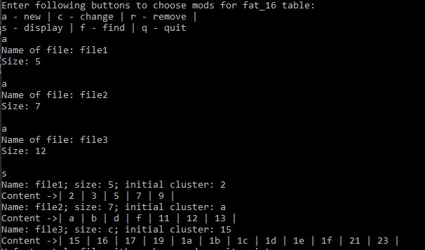
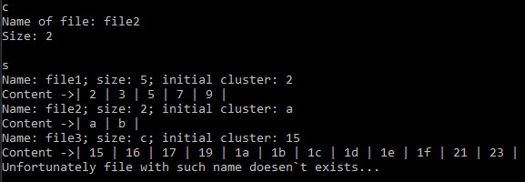
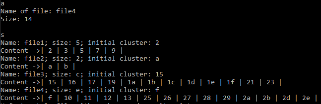
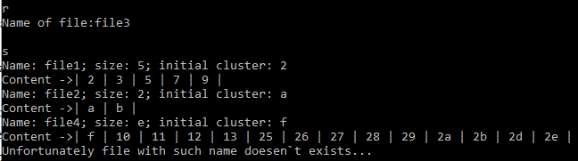
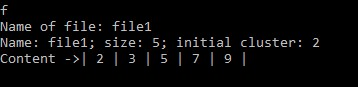

<h1> FAT-16 file system table</h1>

## General info
Implementation of the file placement table according to the model file system FAT-16.
Simulation of the processes of creating files of a given size in clusters, reducing files by a given number of clusters, and destroying files.
It is possible to search for files by their identifier and print out the numbers of the clusters occupied by the file.
Nevertheless, in this embodiment, the maximum possible number of clusters is specified, while a certain number of defective clusters are placed alternately with normal ones.

## Technologies
Project is created with:
* C++
* gcc: version 6.3.0

	
## Setup
git clone and run a program with the following makefile:

<code>$ make</code>

## FAT-16 description

A file allocation table (FAT) is an area on a hard disk or floppy disk that contains information about each file stored and unallocated space on the disk. FAT16 specifies that the size of each entry in the file allocation table on the disk is 16 bits. In other words, it uses 16 bits to address clusters. A cluster refers to a unit of disk space allocation.
When a particular file is deleted; the entry for that file is removed from the file table, but the contents remain as is (and will be overwritten later). So the file placement table is similar to the book table index are the file system identifiers associated with the FAT16 volumes. The first 2 clusters are used for the FAT16 boot record and for the directory table.
The following advantages of using this file storage system can be highlighted. The file size is relatively longer compared to FAT12, and it also has higher speed and memory. Reduced interface complexity and versatility. At the same time, you can highlight such disadvantages as the loss of storage space for large drives, and the root folder can manage a maximum of 512 records. Files larger than 2GB cannot be created. As the size of the cluster increases, inefficiency increases at larger sizes.
During the execution of the task, a model of the FAT-16 file system was designed for this work, which, given the maximum possible number of clusters of 65536 and with a given number of defective clusters, creates files of the given size. With the help of a special menu, you can destroy the relevant files, search by identifier, and display the numbers of the clusters occupying the file. During the testing, the functionality of the system was checked. On the example of the first test, you can see the sequential addition of three files to the screen with the designation of the sizes of the clusters and the output of the addresses of these clusters. As you can see, the numbers of these particles are not consistent due to the fact that the table provides for defective clusters, which with a probability of 50% will appear in every second cell. The definition of table location numbers is determined by specifying the initial number of the address where the address value of the next cluster allocated to this file is stored. That is why there are no conflicts when traversing memory due to the presence of a chain system, which helps to connect elements that are not always sequentially located in the file table. The change in the capacity of the file shows the ability of the model to use the freed clusters to make the next added files available.

# Program interface features

<h4>File createion</h4>

<h4>File size decreasing</h4>

<h4>Adding new files after its change in the system</h4>

<h4>File deletion</h4>

<h4>Serching an appropriate file</h4>

